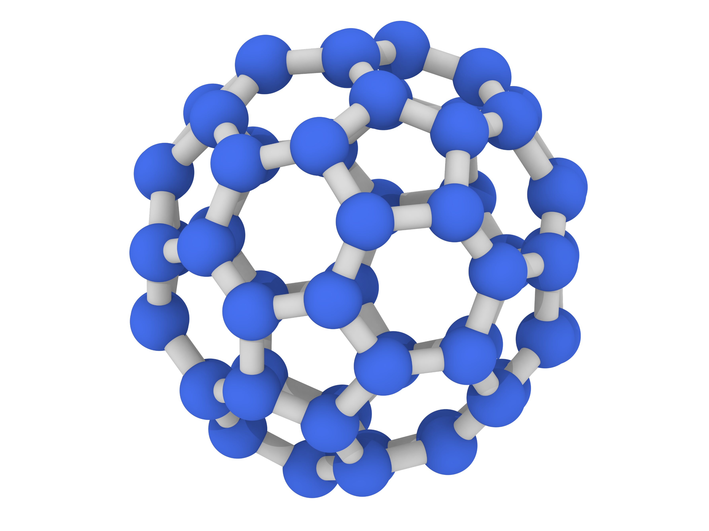

# MP60 Simulation Guide

Welcome to the MP60 simulation repository! This repository contains all the files and instructions necessary to run and visualize simulations of an MP60 molecule.

---

## Prerequisites

Before running the simulation, ensure you have **specific LAMMPS packages** installed. Follow the instructions in the [`Compile_Correct_LAMMPS.sh`](./Compile_Correct_LAMMPS.sh) file to compile LAMMPS properly. 

If you need support, feel free to reach out to:  
📧 **m.paesani@uva.nl**

---

## Files Included in This Repository

### 1. `MP60.data`
- **Description**: This file contains the initial positions of individual beads and bond connection information.  
- **Usage**: Use your preferred visualization tool (e.g., **Ovito**, **VMD**, or **PyMol**) to inspect the molecular structure.

### 2. `MP60_Eq.lammps`
- **Description**: The input file to run the simulation of one MP60 molecule in a box with implicit solvent.  
- **Run Command**:
  ```bash
  lmp -in MP60_Eq.lammps
  ```
- **Performance**: A full run should take approximately **10 minutes** and require about **700 MB** of storage.

### 3. `dump.lammpstrj`
- **Description**: Contains the complete particle trajectory.  
- **Visualization**: Import this file into Ovito or your chosen tool to visualize particle motion.

### 4. `bonds.txt`
- **Description**: Contains bond information for the entire trajectory.  
- **Visualization**: Use this file with Ovito's "Load Trajectory" modification.

### 5. `end-to-end-distance.dat`
- **Description**: Logs the distance between the centers of mass of two opposite hexagons throughout the simulation.

### 6. `Ovito_Bond_Presets.png`
- **Description**: A helpful image showing the correct settings for loading bond information into Ovito.  
  

---

## Visualization with Ovito

To visualize the simulation in **Ovito**, follow these steps:

1. Import the `dump.lammpstrj` file to visualize particle motion.
2. Add the **"Load Trajectory"** modification and load `bonds.txt` for bond information.
3. Apply the bond settings using the provided `Ovito_Bond_Presets.png`.

---

## Additional Notes
- Ensure that LAMMPS is compiled correctly before running the simulation. Refer to the `Compile_Correct_LAMMPS.sh` script.
- For optimal visualization, use Ovito and load the bond information as described above.

---

Enjoy running and analyzing your MP60 simulations! 😊

